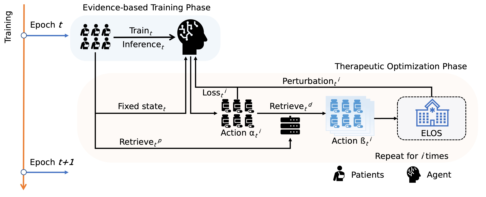

# MiranDa
I've been a huge fan of the Biohazard games since I was 12 years old, so I named this model after one of the characters from RE8.


[**MiranDa**: **Mi**micking the Lea**r**ning Process of Hum**an D**octors to Achieve C**a**usal Inference for Medication Recommendation](https://arxiv.org/submit/5536286/view)  


### Visulize medication combinations in Hyperbolic space


## Datasets

All input data have been accessed through credential verification from public sources, including [MIMIC III database](https://physionet.org/content/mimiciii/1.4/) and [MIMIC IV database](https://physionet.org/content/mimiciv/0.4/).
### preprocessing
It’s quite complex. I will provide the code upon acceptance of the paper. However, I have already included sufficient details about the preprocessing in the paper, so you should be able to handle it on your own as well.

## Train/inference
we utilized a range of random seed values from 0 to 29, facilitating 30 distinct dataset splits into training, validation, and test sets for MIMIC III database, and 0 for MIMIC IV database.
The models underwent a training period of 50 epochs, with an early stopping mechanism initiated from the fifth epoch, set to withstand a tolerance of three epochs. Decay factor λ, threshold δ,
Confidence γ, Blend factor ϵ was 0.9, 0.2, 0.5, 0.2. The learning rate is 1 × 10−3. A batch size of 512 was uniformly adhered to across the experiment

```bash
python MiranDa.py
```
## Hypermeters

You can adjust different hyperparameters in the cfg.py file.

| Hypermeters              | Description                                                  |
| ------------------------ | ------------------------------------------------------------ |
| `dataset_list`           | Train models for different datasets |
| `train_all_models`       | Train different agents |
| `save_memory`            | Delete useless features  |
| `read_data`              | Skip the preprocessing |
| `train_the_last`         | I guess it's important, but I keep forgetting. If anyone is interested, please let me know.|

If you have any questions, please let me know. E-mail: wang@med.tohoku.ac.jp
